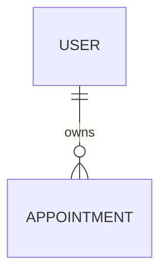

## ER図
エンティティと関係は何ですか？
例: 利用者は複数の予定を持つ。

```mermaid
erDiagram
    USER ||--o{ APPOINTMENT : owns
```

## テーブル定義の表
各テーブルにどの列と制約がありますか？
| テーブル | 列 | 型 | 制約 | 説明 |
|---|---|---|---|---|

## 保持期間
データをいつまで保持しますか？
例: 終了した予定は1年間保持する。
